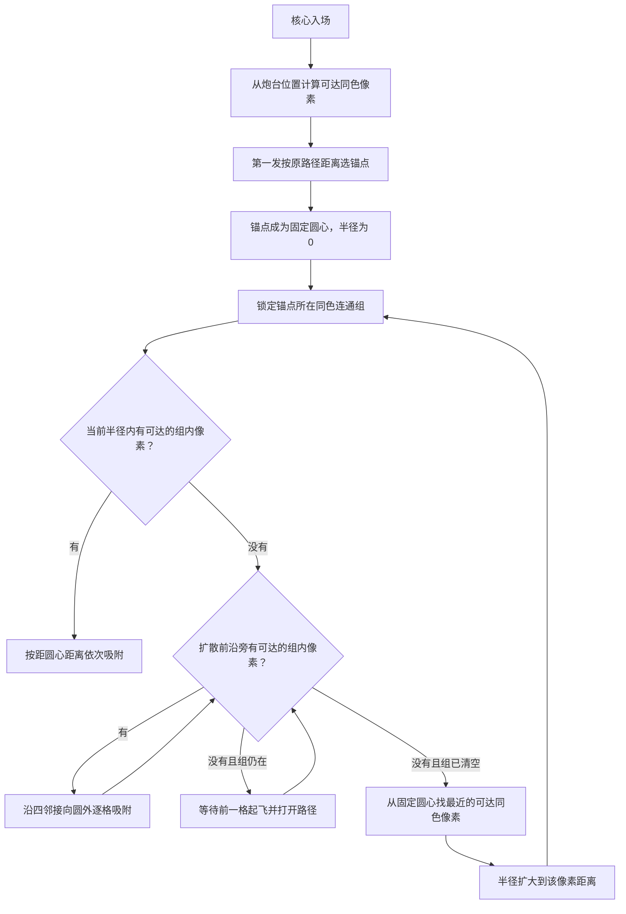

# 吸附逻辑

## 目标

同色能量核心首次命中一个可达像素后，以该像素为**固定搜索圆心**，按半径由近到远寻找下一片同色区域。

搜索半径决定“先发现哪一片”；同色四邻接连通关系决定“这一片可以向圆外消除到哪里”。两者都不能绕过地图阻挡。

## 术语

- **可达像素**：从炮台所在列的下方空白区域，能沿上下左右四方向穿过空格接近的存活像素。被其他像素包住的内部格不属于可达像素。
- **固定圆心**：该核心第一发锁定的像素中心。在核心离场前不再改变。
- **搜索半径**：固定圆心到当前命中区域种子点的实际欧氏距离；只会增加，不会回退。
- **同色连通组**：仅通过上下左右相邻连接的同色像素集合；对角线相邻不算连接。
- **扩散前沿**：当前连通组中已经真正起飞的像素格。它们的四邻格可以成为下一次向圆外扩散的候选。

## 执行流程

## 详细规则

1. 第一发

   第一发保持原有规则：只在当前可达的同色像素中选择，按从炮台出发的路径距离最短者作为锚点。锚点同时成为固定圆心。

2. 圆内消除

   当半径扩大到一个新的可达种子点时，优先消除该半径内、且属于当前同色连通组的所有**可达**像素。若同一半径内有多个断开的连通组，当前组清完后会继续处理半径未增加时的其他可达组。

3. 圆外连通扩散

   圆内候选清完后，仅从已经起飞像素的上下左右邻格继续寻找当前连通组成员。候选依然必须可达；因此外层方块尚未离开时，内部像素不能跨越外层直接起飞。

4. 扩大半径

   当前连通组没有存活或待起飞像素后，核心回到固定圆心，从所有当前可达的同色像素中选择距离圆心最近的一个作为下一组种子。搜索半径更新为该距离与旧半径中的较大值。

5. 无可达前沿时的解锁

   若当前锁定组已经没有可达像素，且也没有待起飞像素能够继续打开路径，核心会解除该组锁定，但保留固定圆心和当前半径，继续搜索其他可达同色组。这样不会因为一个被封住的旧组而卡住地图上已经可达的像素。

6. 发射节奏

   每次只确认一个目标。像素真正开始起飞后才加入扩散前沿，保证向外表现为逐格波纹，而非跨区域批量跳转。

## 不变量

- 任何被吸附的像素在被选中时都必须是可达像素。
- 连通只认同色上下左右相邻；不会跨越空格、不同颜色或对角线。
- 圆心固定，半径单调递增。
- 连通组可以越过当前圆，但只能从已打开的可达路径逐格向外延伸。
- 一个核心的圆心、半径和连通扩散状态只在该核心留在阵地期间有效。

## 对应实现

- `findReachableTargets`：计算当前可达像素。
- `makeSnapGroup`：生成同色四邻接连通组。
- `getTargets`：维护固定圆心、搜索半径、圆内优先和圆外前沿扩散。
- `advanceEnergy`：目标真正起飞时更新扩散前沿。

实现位于 `game.js`。
